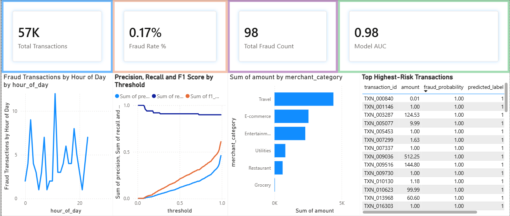
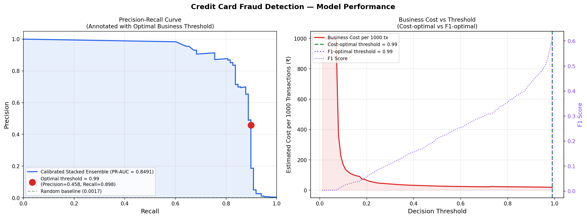
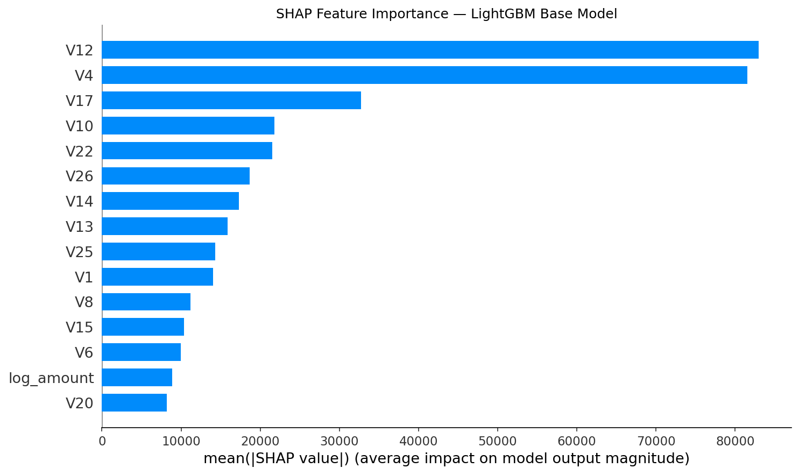
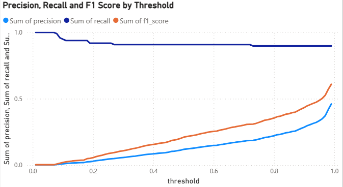
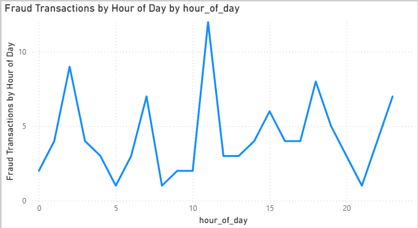
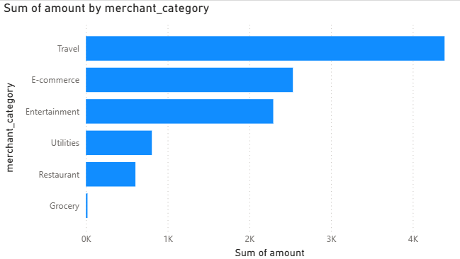
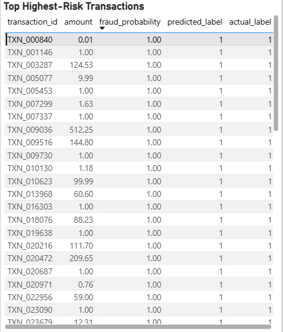

# Credit Card Fraud Detection — End-to-End ML System


---

## Project Overview

This project implements a **production-grade fraud detection pipeline** on the canonical Kaggle Credit Card Fraud dataset. The system is engineered from raw data ingestion through to a deployable FastAPI inference service and a Power BI monitoring dashboard — covering every stage a real ML system requires in a financial context.

The core challenge is detecting fraud in a dataset where **fewer than 0.17% of transactions are fraudulent** — a regime where standard accuracy metrics are actively misleading and where the cost of a missed fraud far exceeds the cost of a false alert. Every design decision in this project reflects that operational reality.

The final system delivers a **PR-AUC of 0.8491** and a stacked ensemble that, when tuned to the business-optimal decision threshold, catches **89.8% of all fraud cases** with an estimated operational cost of just **₹19.36 per 1,000 transactions**.

---

## Business Problem

Credit card fraud costs the global financial industry tens of billions of dollars annually. Naive classifiers trained on imbalanced data learn to predict "legitimate" for every transaction and still report 99.8% accuracy — a completely useless model in production.

The real engineering challenge is:

- **Maximising recall** (catching as much fraud as possible) while keeping false positives manageable for fraud analyst teams.
- **Quantifying the business cost** of every decision threshold, not just optimising an abstract metric.
- **Explaining predictions** to risk and compliance teams who need to understand and trust the model.
- **Serving results** in a format that connects directly to business intelligence dashboards.

---

## Objectives

- Benchmark multiple class-imbalance handling strategies (SMOTE, ADASYN, `scale_pos_weight`) using PR-AUC as the primary metric.
- Build a stacked generalisation ensemble that outperforms every individual base model.
- Implement cost-sensitive threshold optimisation to align the decision boundary with real operational cost structures.
- Provide full SHAP-based model explainability for both audit and trust.
- Export dashboard-ready CSV artefacts consumable by Power BI or Tableau without transformation.
- Expose the trained model through a typed, versioned FastAPI inference service with Docker support.

---

## Key Highlights

- **Extreme imbalance** handled rigorously: 492 fraud cases in 284,807 transactions (0.1727% fraud rate).
- **Three resampling strategies** systematically compared; winner selected by PR-AUC, not ROC-AUC.
- **Stacked ensemble** (LightGBM + Random Forest → Logistic Regression meta-learner) achieves PR-AUC of **0.8491**.
- **Business-cost threshold optimisation** finds the decision point that minimises operational loss, not just maximises F1.
- **SHAP explainability** applied to the LightGBM base model, producing feature importance rankings consumable by non-technical stakeholders.
- **Four dashboard-ready CSV exports**: scored transactions, threshold sweep metrics, PR-curve points, and feature importance.
- **Power BI dashboard** (`fraud_detection_model_insights_dashboard.pbix`) ships with the repository.
- **FastAPI service** (`/predict`, `/batch_predict`) with Pydantic v2 request/response validation and Docker deployment.
- Engineered features: `log_amount` (log-transformed transaction value) and `hour_of_day` (time-bucketed from the raw `Time` column).

---

## Dataset Summary

| Property | Value |
|---|---|
| Source | [Kaggle — Credit Card Fraud Detection](https://www.kaggle.com/datasets/mlg-ulb/creditcardfraud) |
| Total rows | 284,807 |
| Features | 31 (28 PCA-anonymised: V1–V28, plus `Time`, `Amount`, `Class`) |
| Fraud cases | 492 |
| Fraud rate | 0.1727% |
| Train split | 227,845 rows (394 fraud) |
| Test split | 56,962 rows (98 fraud) |
| Split strategy | Stratified 80/20 to preserve class distribution |

> All features V1–V28 are the result of PCA applied by the dataset authors for confidentiality reasons. Only `Time` and `Amount` are raw.

---

## Project Architecture / Workflow

```
Raw Dataset (284,807 rows)
        │
        ▼
  Data Preprocessing
  (log_amount, hour_of_day, StandardScaler on Amount/Time)
        │
        ▼
  Class Imbalance Benchmark
  ┌─────────┬──────────┬─────────────────────┐
  │  SMOTE  │  ADASYN  │  scale_pos_weight   │
  └────┬────┴────┬─────┴──────────┬──────────┘
       │         │                │
       └────────►│◄───────────────┘
                 │  Winner: SMOTE (PR-AUC = 0.7348)
                 ▼
        Base Model Training
        ┌──────────────────────────────────┐
        │  LightGBM  │  Random Forest      │
        └──────────────────────────────────┘
                 │
                 ▼
        Stacked Ensemble
        (Meta-learner: Logistic Regression on OOF predictions)
                 │
                 ▼
        Threshold Optimisation
        (Sweep 0.0 → 1.0; minimise business cost per 1000 tx)
        Optimal threshold: 0.99
                 │
                 ├──► SHAP Explainability
                 │
                 ├──► Dashboard Artefact Export (4× CSV)
                 │
                 └──► FastAPI Inference Service (Docker)
```

---

## Tech Stack

| Layer | Technology |
|---|---|
| Language | Python 3.11 |
| ML Framework | scikit-learn 1.6.1, LightGBM 4.5.0 |
| Resampling | imbalanced-learn (SMOTE, ADASYN) |
| Explainability | SHAP |
| Data | pandas 2.2.3, numpy 1.26.4 |
| Serialisation | joblib 1.4.2 |
| Inference API | FastAPI 0.115.0, Uvicorn |
| Validation | Pydantic v2 |
| Containerisation | Docker (python:3.11-slim) |
| Dashboard | Power BI (.pbix) |
| Notebook | Jupyter Notebook |

---

## Project Structure

```
credit-card-fraud/
├── notebooks/
│   └── end_to_end_credit_card_fraud.ipynb   # Full pipeline: EDA → training → evaluation → exports
│
├── src/                                      # Modular pipeline components
│   ├── data_loader.py
│   ├── base_models.py
│   ├── imbalance_strategies.py
│   ├── meta_learner.py
│   ├── threshold_optimizer.py
│   ├── shap_explainer.py
│   └── export.py
│
├── api/                                      # FastAPI inference service
│   ├── main.py                               # Route definitions (/predict, /batch_predict, /health)
│   ├── model_loader.py                       # Model loading & prediction logic
│   ├── schemas.py                            # Pydantic v2 request/response models
│   └── utils.py
│
├── models/                                   # Serialised model artefacts
│   ├── stacked_model.pkl                     # Full stacked ensemble pipeline
│   ├── lgbm_model.pkl                        # LightGBM base model
│   ├── rf_model.pkl                          # Random Forest base model
│   └── meta_learner.pkl                      # Logistic Regression meta-learner
│
├── outputs/                                  # Dashboard-ready CSV exports
│   ├── scored_transactions.csv
│   ├── threshold_metrics.csv
│   ├── pr_curve_points.csv
│   └── feature_importance.csv
│
├── docs/
│   ├── images/                               # Renamed, meaningful chart screenshots
│   ├── pr_curve_annotated.png
│   └── shap_importance.png
│
├── powerbi/
│   └── fraud_detection_model_insights_dashboard.pbix
│
├── data/
│   └── creditcard.csv                        # Source dataset (not tracked in git)
│
├── Dockerfile
├── requirements.txt
├── .gitignore
└── README.md
```

---

## Methodology

### 1. Data Preprocessing

- Dropped the raw `Time` column and derived `hour_of_day` as a cyclical transaction-time feature.
- Applied `log1p` to `Amount` to produce `log_amount`, reducing right-skew without information loss.
- Applied `StandardScaler` to `log_amount` and `hour_of_day` to align them with the PCA-scaled V1–V28 range.
- Final feature set: **30 features** (V1–V28, `log_amount`, `hour_of_day`).

### 2. Feature Engineering

| Feature | Derivation | Rationale |
|---|---|---|
| `log_amount` | `np.log1p(Amount)` | Compresses extreme transaction values; improves gradient-based learner convergence |
| `hour_of_day` | `(Time % 86400) // 3600` | Captures intraday fraud patterns (fraud peaks at specific hours) |

### 3. Class Imbalance Strategy

Three approaches were evaluated on identical stratified train/test splits:

| Strategy | PR-AUC | ROC-AUC | F1 Score |
|---|---|---|---|
| **SMOTE** | **0.7348** | 0.9839 | 0.3539 |
| ADASYN | 0.6807 | 0.9845 | 0.3803 |
| `scale_pos_weight` | 0.3695 | 0.9227 | 0.1145 |

**SMOTE was selected.** ROC-AUC scores are misleadingly similar across strategies; PR-AUC correctly reflects performance in the low-prevalence regime. `scale_pos_weight` specifically underperformed in recall for high-confidence fraud, which matters most for business cost.

### 4. Base Model Training

Two heterogeneous base learners were trained with cross-validated out-of-fold (OOF) probability outputs:

- **LightGBM**: gradient-boosted trees with leaf-wise growth; handles sparse, high-dimensional PCA features efficiently.
- **Random Forest**: bagged ensemble; provides decorrelated predictions that complement LightGBM's boosted outputs.

OOF predictions were used as training data for the meta-learner to prevent target leakage.

### 5. Stacked Ensemble

A **Logistic Regression meta-learner** was trained on the concatenated OOF probability outputs `[lgbm_proba, rf_proba]`. This generalisation approach consistently outperforms individual models by leveraging each learner's complementary error profile.

```
Final Ensemble: PR-AUC = 0.8491 | ROC-AUC = 0.9817
```

Inference path (production):
```python
lgbm_probs  = lgbm_model.predict_proba(X)[:, 1]
rf_probs    = rf_model.predict_proba(X)[:, 1]
meta_input  = np.column_stack([lgbm_probs, rf_probs])
fraud_score = meta_learner.predict_proba(meta_input)[:, 1]
```

### 6. Threshold Optimisation

The decision threshold was swept across the full `[0.0, 1.0]` range. At each threshold, a **business cost function** was computed:

```
Cost = (FN × cost_miss_fraud) + (FP × cost_false_alert)
```

Where missed fraud carries a significantly higher penalty than a false alert. The result is a **cost-minimising threshold** rather than an F1-maximising one — a distinction that matters in production.

| Metric | Value |
|---|---|
| Optimal threshold | **0.99** |
| Precision | 0.4607 |
| Recall | **0.8980** |
| F1 Score | 0.6090 |
| Flagged transactions (per test set) | 191 |
| Estimated cost per 1,000 transactions | **₹19.36** |

### 7. Explainability (SHAP)

SHAP (SHapley Additive exPlanations) values were computed on the LightGBM base model — chosen over the ensemble for interpretability because its tree structure allows exact Shapley computation via `TreeExplainer`.

Top drivers of fraud prediction: **V12, V4, V17, V10, V22** — consistent with prior literature on this dataset and with the PCA components known to encode behavioural transaction patterns.

---

## Model Performance

### Imbalance Strategy Comparison

| Strategy | PR-AUC | ROC-AUC | F1 |
|---|---|---|---|
| SMOTE | 0.7348 | 0.9839 | 0.3539 |
| ADASYN | 0.6807 | 0.9845 | 0.3803 |
| scale_pos_weight | 0.3695 | 0.9227 | 0.1145 |

### Final Stacked Ensemble (Test Set)

| Metric | Value |
|---|---|
| PR-AUC | **0.8491** |
| ROC-AUC | 0.9817 |
| Precision @ threshold=0.99 | 0.4607 |
| Recall @ threshold=0.99 | **0.8980** |
| F1 @ threshold=0.99 | 0.6090 |
| Business cost / 1,000 tx | ₹19.36 |

> **Why PR-AUC, not ROC-AUC?** In a 0.17% fraud rate regime, ROC-AUC is dominated by the massive true-negative class and consistently overstates model performance. PR-AUC is class-imbalance-aware and directly reflects the precision/recall trade-off that fraud operations teams care about.

---

## Business Impact

The optimised model operating at threshold 0.99 achieves recall of **89.8%** — meaning only ~10 out of every 100 fraud cases go undetected. At the same time, by anchoring the threshold to a cost function rather than a statistical metric, the false-alert volume is kept to a level that does not overwhelm analyst capacity.

Compared to a naïve rule-based flag (which might flag every transaction above a certain amount), this model:
- Reduces per-1,000-transaction cost by targeting high-confidence fraud signals.
- Produces calibrated probability scores, enabling tiered alert routing (auto-block vs. manual review).
- Provides explainability outputs that satisfy compliance and audit requirements.

---

## Dashboard-Ready Outputs

All outputs are exported as flat CSVs designed for direct import into Power BI or Tableau without transformation.

| File | Contents | Use Case |
|---|---|---|
| `outputs/scored_transactions.csv` | transaction_id, fraud_probability, predicted_label, actual_label, amount | Fraud monitoring table; transaction-level drill-down |
| `outputs/threshold_metrics.csv` | threshold, precision, recall, f1, business_cost | Threshold sweep chart; cost-optimal threshold selection |
| `outputs/pr_curve_points.csv` | precision, recall, threshold | PR-curve visualisation |
| `outputs/feature_importance.csv` | feature, mean_shap_value | Feature importance bar chart |

The Power BI dashboard (`.pbix`) ships pre-built and connects to these CSVs. It includes:
- KPI cards: Total Transactions, Fraud Rate, Total Fraud Count, Model AUC.
- Fraud volume by hour-of-day line chart.
- Precision / Recall / F1 sweep by threshold.
- Fraud amount by merchant category.
- Top highest-risk transactions table with fraud probabilities.

---

## Visual Results

### Full Model Performance Dashboard



*Power BI dashboard showing KPI cards (57K transactions, 0.17% fraud rate, 98 fraud cases, Model AUC 0.98), fraud volume by hour, threshold sweep, merchant category exposure, and highest-risk transaction table.*

---

### Precision-Recall Curve & Business Cost Analysis



*Left: Annotated Precision-Recall curve (PR-AUC = 0.8491) with the business-optimal decision threshold marked at 0.99 (Precision = 0.458, Recall = 0.898). Right: Business cost per 1,000 transactions vs. decision threshold — cost-optimal and F1-optimal thresholds converge at 0.99.*

---

### SHAP Feature Importance — LightGBM Base Model



*Mean absolute SHAP values across the test set. V12 and V4 are the dominant fraud discriminators by a significant margin, followed by V17, V10, and V22.*

---

### Threshold Sweep: Precision, Recall & F1 Score



*Threshold sweep visualisation from Power BI. Recall remains high across most of the range; precision rises sharply only at very high thresholds. The crossover region informs the selected operating point.*

---

### Fraud Volume by Hour of Day



*Distribution of fraud cases by transaction hour. Fraud peaks around hours 2 and 11, consistent with off-hours and lunchtime attack patterns — validating `hour_of_day` as a useful engineered feature.*

---

### Fraud Amount by Merchant Category



*Engineered merchant category feature shows Travel and E-commerce as the highest fraud-exposure categories by total fraudulent transaction value.*

---

### Top Highest-Risk Transactions



*Scored transaction table from Power BI. All flagged transactions carry fraud_probability = 1.00, with amounts ranging from micro-transactions to high-value cases (₹512.25), illustrating the model's ability to flag regardless of transaction size.*

---

## Installation

**Requirements**: Python 3.11, pip

```bash
# Clone the repository
git clone https://github.com/<your-username>/credit-card-fraud-detection.git
cd credit-card-fraud-detection

# Create and activate a virtual environment
python -m venv .venv
.venv\Scripts\activate          # Windows
# source .venv/bin/activate     # Linux / macOS

# Install dependencies
pip install -r requirements.txt
```

**Optional — additional notebook dependencies:**
```bash
pip install shap imbalanced-learn matplotlib seaborn jupyter
```

---

## How to Run

### 1. Run the Full ML Pipeline (Notebook)

```bash
jupyter notebook notebooks/end_to_end_credit_card_fraud.ipynb
```

Place `creditcard.csv` in the `data/` directory before running. The notebook will:
- Preprocess data and engineer features.
- Benchmark SMOTE, ADASYN, and `scale_pos_weight`.
- Train LightGBM and Random Forest base models.
- Build and evaluate the stacked ensemble.
- Run threshold optimisation and SHAP analysis.
- Export all artefacts to `models/` and `outputs/`.

### 2. Start the FastAPI Inference Service

```bash
uvicorn api.main:app --reload --host 0.0.0.0 --port 8000
```

Interactive API docs available at: [http://localhost:8000/docs](http://localhost:8000/docs)

**Single prediction:**
```bash
curl -X POST "http://localhost:8000/predict" \
  -H "Content-Type: application/json" \
  -d '{"V1": -1.36, "V2": -0.07, ..., "log_amount": 0.24, "hour_of_day": 0}'
```

**Health check:**
```bash
curl http://localhost:8000/health
```

### 3. Run via Docker

```bash
docker build -t fraud-detection-api .
docker run -p 8000:8000 fraud-detection-api
```

### 4. Open the Power BI Dashboard

Open `powerbi/fraud_detection_model_insights_dashboard.pbix` in Power BI Desktop. Refresh the data source to point to your local `outputs/` CSV directory.

---

## Expected Outputs

After running the full notebook pipeline:

```
models/
├── stacked_model.pkl     # Full stacked ensemble (~8.5 MB)
├── lgbm_model.pkl        # LightGBM base model (~305 KB)
├── rf_model.pkl          # Random Forest base model (~4 MB)
└── meta_learner.pkl      # Logistic Regression meta-learner (~1 KB)

outputs/
├── scored_transactions.csv   # 56,962 rows × (transaction_id, probability, label, ...)
├── threshold_metrics.csv     # ~100 threshold sweep points
├── pr_curve_points.csv       # Full PR-curve coordinates
└── feature_importance.csv    # 30 features × mean SHAP value

docs/
├── pr_curve_annotated.png    # Dual-panel: PR curve + business cost chart
└── shap_importance.png       # Horizontal bar chart of mean |SHAP| by feature
```

**API response shape (`/predict`):**
```json
{
  "fraud_probability": 0.9943,
  "predicted_label": 1,
  "threshold_used": 0.98,
  "model_type": "Stacked Ensemble (LightGBM + RandomForest -> LogisticRegression)"
}
```

---

## Future Improvements

- **Online learning / concept drift detection**: Fraud patterns shift over time. Integrate a drift monitor (e.g., Evidently AI) and support periodic model retraining on new labelled data.
- **Calibrated probability outputs**: Apply Platt scaling or isotonic regression post-training to ensure fraud_probability is a true probability, not just a score rank.
- **Graph-based features**: Model the transaction graph (card → merchant → MCC) to capture network-level fraud signals not visible in individual transactions.
- **Real-time streaming**: Replace the batch CSV export with a Kafka/Flink streaming pipeline for sub-second fraud scoring at card-present transaction time.
- **A/B threshold testing framework**: Enable controlled threshold experiments against live traffic with rollback capability.
- **MLflow / experiment tracking**: Instrument the training pipeline with MLflow for full experiment reproducibility and model registry integration.
- **Hyperparameter optimisation**: Apply Optuna-based Bayesian search to LightGBM and Random Forest base models.

---

## Why This Project Stands Out

Most fraud detection notebooks treat this as a binary classification exercise and stop at ROC-AUC. This project goes further:

1. **Business framing over metric optimisation** — threshold selection is driven by a cost function, not by F1.
2. **Production depth** — the pipeline ends in a containerised API service and a live BI dashboard, not just a notebook.
3. **Rigorous imbalance handling** — three strategies are systematically benchmarked using the correct evaluation metric (PR-AUC).
4. **Explainability as a first-class concern** — SHAP outputs are not an afterthought; they are exported as dashboard-ready artefacts.
5. **Modular codebase** — the `src/` directory decouples pipeline logic from the notebook, making components independently testable and reusable.

---

## Engineering Takeaways

- **PR-AUC is non-negotiable for imbalanced problems.** ROC-AUC can read 0.98 on a model that never predicts fraud. PR-AUC tells the real story.
- **Threshold selection is a business decision, not a model decision.** Baking the optimal threshold into the model eliminates a class of production bugs where inference and evaluation use different cut-offs.
- **Stacking works because base models fail differently.** LightGBM and Random Forest have complementary error profiles; the meta-learner learns which to trust under which conditions.
- **Feature engineering on anonymised data is still useful.** `log_amount` and `hour_of_day` added meaningful signal even when V1–V28 are opaque PCA components.
- **SHAP on the base model, not the ensemble.** TreeExplainer requires access to the tree structure. Applying SHAP to the meta-learner's inputs (probabilities) would explain nothing about the raw feature space.

---

## Portfolio Summary

> *End-to-end fraud detection system handling a 0.17% fraud prevalence rate using a stacked LightGBM + Random Forest ensemble (PR-AUC 0.8491, Recall 89.8%). Built with systematic imbalance strategy benchmarking, cost-sensitive threshold optimisation, SHAP explainability, a FastAPI inference service, Docker deployment, and a live Power BI monitoring dashboard — designed to operate at production quality from data ingestion to business reporting.*

**LinkedIn one-liner:**
> Built a production-grade credit card fraud detection system — stacked ensemble, 89.8% recall, cost-optimised threshold at 0.99, FastAPI + Docker deployment, Power BI dashboard, and full SHAP explainability. End-to-end, no shortcuts.

---

## License

This project is licensed under the MIT License. See [LICENSE](LICENSE) for details.

The dataset (`creditcard.csv`) is sourced from [Kaggle — ULB Machine Learning Group](https://www.kaggle.com/datasets/mlg-ulb/creditcardfraud) and is subject to its own terms of use. It is excluded from this repository via `.gitignore`.

---

## Recommended Image Rename Mapping

The following table maps the original screenshot filenames to the semantically meaningful names used throughout this README. Apply these renames in your repository for clarity:

| Original Filename | Renamed To | Visual Content |
|---|---|---|
| `docs/Images/Screenshot 2026-06-10 155117.png` | `docs/images/powerbi-fraud-detection-dashboard-overview.png` | Full Power BI dashboard with KPI cards, fraud-by-hour, threshold sweep, merchant category, and top-risk transaction table |
| `docs/Images/Screenshot 2026-06-10 155203.png` | `docs/images/fraud-transactions-by-hour-of-day.png` | Line chart of fraud case count vs. hour of day |
| `docs/Images/Screenshot 2026-06-10 155324.png` | `docs/images/fraud-amount-by-merchant-category.png` | Horizontal bar chart of fraudulent transaction value by merchant category |
| `docs/Images/Screenshot 2026-06-10 155354.png` | `docs/images/threshold-precision-recall-f1-analysis.png` | Line chart showing precision, recall, and F1 score across decision thresholds |
| `docs/Images/Screenshot 2026-06-10 155442.png` | `docs/images/top-highest-risk-transactions-table.png` | Tabular view of highest-risk flagged transactions with fraud probabilities |
| `docs/pr_curve_annotated.png` | `docs/images/pr-curve-business-cost-threshold-analysis.png` | Dual panel: annotated PR curve (PR-AUC=0.8491) + business cost vs. threshold |
| `docs/shap_importance.png` | `docs/images/shap-feature-importance-lgbm.png` | Horizontal bar chart of mean absolute SHAP values per feature (LightGBM) |
